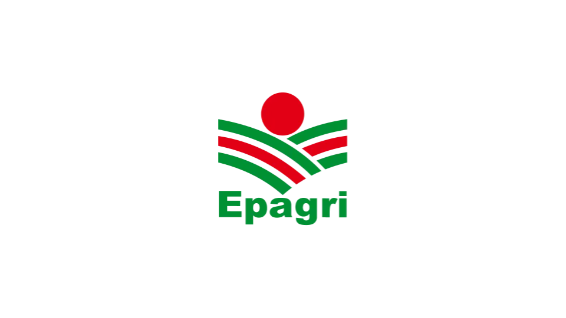
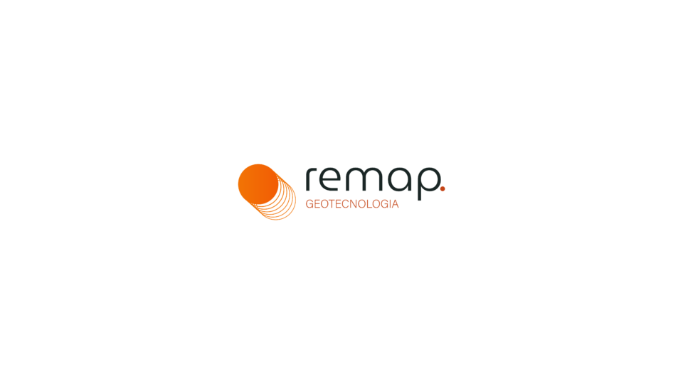

<h1 align="center"> Mapeamento da Pastagem no estado de Santa Catarina</h1>

[//]:#(imagem_pastagem)
 

    
    
<i>Figura 1: Lapig(11/2025).</i>

[//]: #(Introducao)
<h2 align="Left">Introdução</h2>
Trabalho de mapeamento das pastagens do estado de Santa Catarina para o ano de 2024 realizado pela parceria entre Lapig e Remapgeo. Utilizando imagens do satélite Sentinel 2A/B com 10 metros de resolução espacial, dados de referência do Mapbiomas e Global Pasture Watch, foi possível gerar uma classificação supervisionada para todo o estado, realizada com o Algorítmo Random Forest, descrita em <a href="mds/visao_geral.md">Visão Geral</a>.
 

[//]: #(Base_de_dados)
<h2 align="Left">Bases de dados</h2>
Foram utilizados como dados de referência os dados de pastagem <a href="https://brasil.mapbiomas.org/">Mapbiomas</a> e global pasture watch do <a href="https://landcarbonlab.org/about-global-pasture-watch/">Land & Carbon Lab</a> para gerar os pontos utilizados.
 

[//]: #(Requisitos)
<h2 align="Left">Requisitos</h2>

 
    <ul>
        <li>Google Earth Engine;</li>
        <li>Python v3.12 ou superior;</li>
        <li>Numpy v2.2.4 python package;</li>
        <li>Gdal binários v3.10.3; </li>
        <li>R v4.5.2;</li>
        <li>Qgis v3.22 ou superior;</li>
        <li>ThRasE v26.x ou superior;</li>
    </ul>    

 

[//]: #(Equipes)
<h2 align="Left">Equipe</h2>

 
    <ul>
        <li><b>Coordenador geral:</b> Laerte Guimarães Ferreira Jr.</li>
        <li><b>Coordenadores técnicos:</b> Poliana Vieira dos Prazeres, Vinicius Vieira Mesquita, Ana Paula Mattos e Silva</li>
        <li><b>Equipe:</b> Ana Paula Assunção, Felipe Jesus, Guilherme Vaz</li>
    </ul>    

 

[//]: #(reconhecimento)
<h2 align="Left">Instituições Parceiras</h2>

| | |
|:---:|:---:|
|Empresa de Pesquisa Agropecuária e Extensão Rural de Santa Catarina| 
  
|
|Laboratório de Processamento de Imagens e Geoprocessamento|
  
|
|Empresa de Consultoria em Geotecnologias|
  
|

