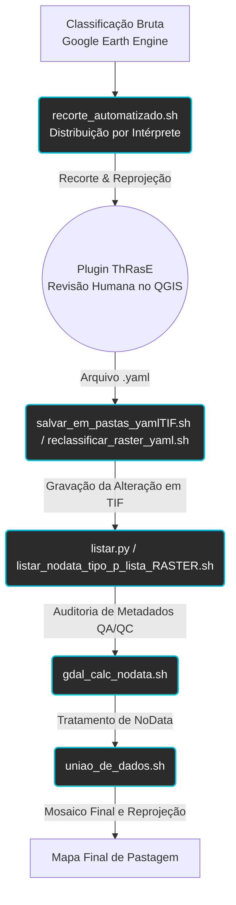

# Etapa 5 — Estratégias de Refinamento

---

## 5.1. Divisão em Tiles

Para garantir a qualidade orgânica do mapa, o estado de Santa Catarina não foi revisado como uma imagem massiva. O limite vetorial do estado foi matematicamente fragmentado formando uma grade (grid) analítica:

| Parâmetro Geométrico | Especificação |
| :--- | :---: |
| **Dimensões do Tile (Célula)** | 10 km x 10 km |
| **Total de Recortes (Tiles)** | 1.373 células |
| **Agrupamento de Gestão** | Blocos de ≈ 25 tiles por intérprete |

Essa fragmentação sistemática permitiu que variações do perfil das pastagens regionais fossem inspecionadas individualmente por especialistas.

---

## 5.2. Preparação dos Dados (Pipeline via Shell)

Após a classificação inicial, uma cadeia de automações baseada em linguagens OS (Shell e Python no padrão WSL/Linux) e bibliotecas espaciais (GDAL) atua em um fluxo de lote ("batch processing"). Esses processos, ilustrados no diagrama abaixo, viabilizam que o plugin no QGIS funcione sem corrupção dos dados de origem:

> **Figura 5 (metodologia):** Pipeline metodológico da preparação de dados para revisão em hardware local.

---

## 5.3. Plugin ThRasE

O plugin ThRasE (thematic raster editor) é uma ferramenta voltada para o processamento de imagens raster que utiliza a técnica de classificação e refinamento de dados espaciais. No contexto do refinamento da classe de pastagem em Santa Catarina, o seu uso foi da seguinte forma:

- Inclusão ou exclusão de pixel da classe de Pastagem e da classe Outros.

O plugin permite "limpar" ruídos da classificação da pastagem, para aumentar a precisão do mapeamento em Santa Catarina. Ele automatiza a criação de máscaras, pixel a pixel, onde o intérprete analisa se uma área pertence ou não à classe de pastagem.

Utilizando o software [QGIS](https://qgis.org/) juntamente com o plug-in [ThRasE](https://github.com/SMByC/ThRasE) e imagens Sentinel, possibilitaram a atividade de refinamento e auditoria dos dados recortados por regiões.

---

## 5.4. Controle de Qualidade

Após os refinamentos realizados através do ThRasE, os revisores retornam uma pasta contendo os arquivos raster matriciais e os diretivos de formato `.yaml` que "gravam" as alterações visuais de adição ou subtração de pixels.

Para materializar estas alterações sem destruir o dado primitivo, o módulo Shell atua em lote (*batch*), lendo o `.yaml` e fundindo num novo raster `.tif`.

Na etapa de **Controle de Qualidade Analítico (QA/QC)**:
1. São listadas as extensões e tipos de dados via Python para evitar metadados nulos no processamento de mesclagem.
2. São conferidas as propriedades de NoData para alinhar matrizes vazias (células sem dados de fundo devem obrigatoriamente possuir um valor mascarado nulo).
3. Após garantir a integridade dos 1.373 pedaços corrigidos, aciona-se o `uniao_de_dados.sh`, devolvendo assim o contorno do mapeamento final, revisado e consolidado para o formato único do estado de Santa Catarina.

---

## Scripts Relacionados

- [recorte_automatizado.sh](../base_dados/aplicacao/Scripts/recorte_automatizado.sh) — Shell (WSL/Linux) — Recorte e reprojeção dos tiles para distribuição por intérprete
- [salvar_em_pastas_yamlTIF.sh](../base_dados/aplicacao/Scripts/salvar_em_pastas_yamlTIF.sh) — Shell (WSL/Linux) — Salvamento das alterações do ThRasE (YAML → TIF)
- [listar.py](../base_dados/aplicacao/Scripts/listar.py) — Python — Listagem de metadados dos arquivos raster
- [listar_nodata_tipo_p_lista_RASTER_v2.sh](../base_dados/aplicacao/Scripts/listar_nodata_tipo_p_lista_RASTER_v2.sh) — Shell (WSL/Linux) — Listagem de NoData, tipo e propriedades dos rasters
- [gdal_calc_nodata.sh](../base_dados/aplicacao/Scripts/gdal_calc_nodata.sh) — Shell (WSL/Linux) — Cálculo e tratamento de valores NoData
- [reclassificar_raster_yaml.sh](../base_dados/aplicacao/Scripts/reclassificar_raster_yaml.sh) — Shell (WSL/Linux) — Reclassificação de raster com base em YAML
- [uniao_de_dados.sh](../base_dados/aplicacao/Scripts/uniao_de_dados.sh) — Shell (WSL/Linux) — União e alinhamento dos dados refinados/auditados

## Requisitos

- Python 3.12 ou superior
- Numpy 2.2.4 python package
- GDAL Binaries 3.10.3
- QGIS com plugin ThRasE instalado

---

**Etapa anterior:** [Etapa 4 — Processamento e Classificação](./04_processamento_classificacao.md)  
**Próxima etapa:** [Etapa 6 — Análise do Mapeamento](./06_analise_mapeamento.md)
